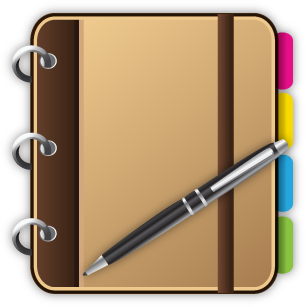

<!--
*** This is the Readme for the Day planner
***  
-->

<!-- Project Shields -->

[![LinkedIn][linkedin-shield]][linkedin-url]

<!-- Project Logo -->
 

    <a href="https://aaguirre7.github.io/my_day/">
        
    <a/>
    <h3 align="center">
        "My Day" a simple day planner
    </h3>
    

        Simple day planner, to taken advantge of all the day has to offer
         
        <a href="https://github.com/aaguirre7/my_day">
            <strong>Explore the docs</strong>
        </a>
         
         
        <a href="https://aaguirre7.github.io/my_day/">
            View the site
        </a>
    

<!-- TABLE OF CONTENTS -->

  
Table of Contents

  <ol>
    <li>
      <a href="#about-the-project">About The Project</a>
    </li>
    <li>
        <a href="#contact">Contact</a>
    </li>

  </ol>

<!-- ABOUT THE PROJECT -->
## About The Project 

[![Product Name Screen Shot][product-screenshot]](./assets/images/screenshot.gif)

### User asked:

AS AN employee with a busy schedule
I WANT to add important events to a daily planner
SO THAT I can manage my time effectively

### Criteria:

* GIVEN I am using a daily planner to create a schedule
* WHEN I open the planner
* THEN the current day is displayed at the top of the calendar
* WHEN I scroll down
* THEN I am presented with time blocks for standard business hours
* WHEN I view the time blocks for that day
* THEN each time block is color-coded to indicate whether it is in the past, present, or future
* WHEN I click into a time block
* THEN I can enter an event
* WHEN I click the save button for that time block
* THEN the text for that event is saved in local storage
* WHEN I refresh the page
* THEN the saved events persist

### What was done.

The page "My day" has been created with the porpuse of making it easy for the user to log and remember the days activities.
Site is done using APIs, Java Script, HTML and CSS
all user's ask has been added to the current working site.   

Thank you for taking time looking at this page.

Happy painting!

(<a href="#top">back to top</a>)

<!-- CONTACT -->
## Contact

Abraham Aguirre Aguirre.Abraham@gmail.com

Project Link: [https://aaguirre7.github.io/my_day/](https://aaguirre7.github.io/my_day/)

<!-- MARKDOWN LINKS & IMAGES -->
[linkedin-shield]: https://img.shields.io/badge/-LinkedIn-black.svg?style=for-the-badge&logo=linkedin&colorB=555
[linkedin-url]: https://www.linkedin.com/in/abraham-aguirre-1b237293/
[product-screenshot]: ./assets/images/screenshot.png 
